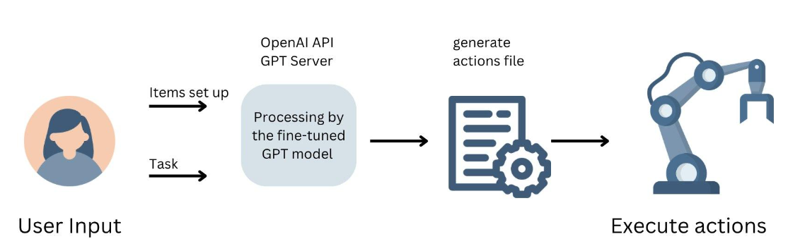

# Robots That Understand: Integrating Large Language Models In Robotics
This repo contains code for generating the actions file (which can be executed directly in the simulator). Two fine-tuned language models based on GPT-3.5 Turbo are implemented to understand the user's requirements of items set-up information and the task. The simulator is based on [ros2_RobotSimulation](https://github.com/IFRA-Cranfield/ros2_RobotSimulation/tree/humble).



## How to run?
- Open 'main.py' and type our models' ID and your personal OpenAI API key.
- Run 'main.py' directly and input demands as users. Finally, you will get the final actions file in the root directory.

## Code Structure
|   Function  | File  |  Description |
|  ----  | ----  | ---- |
| GPT Finetuning 1  | LLM_module/fine_tune/our_fine_tune_model.ipynb | Return a dictionary including extracted keywords from the user's requirements about tasks. |
| GPT Finetuning 2  | LLM_module/fine_tune/second_our_fine_tune_model.ipynb | Return an executable ros2 command of items set up on the table based on user's requirements. |
| Training Datasets  | LLM_module/fine_tune/dataset_dic.py | Self-defined training datasets fit in the fine-tuning process of GPT-3.5 Turbo model. |
| Extracted language processor  | processor.py | Return the final actions file based on the extracted keywords which is returned by the fine-tuned GPT model. |
| Actions file example | action_file.txt | An example file to show the general format of the actions file. |
| Sub-task 1: Items setup | items_setup.py | A prompt step is included to record the user's requirements. Execute items setup tasks automatically. |
| Sub-task 1: Execute actions | execute_action.py | A prompt step is included to record the user's requirements. Execute item movement tasks automatically. |
| main file  | main.py | A combined version of the two sub-tasks. |

## About Fine tuning
For the keywords extraction tasks, here is an example of how our fine-tuned GPT model works:
```
>>Prompts: What Can I help you today?
>>User: I want to place the cup 10cm in front of the box.
>>Output: {'what': 'cup',
    'how': 'move',
    'location': {'precise': 'False',
     'relation': 'box',
     'direction': 'forward',
     'distance': '10 cm'}
}

```

## Demonstration video
[](https://youtu.be/3EzFYXBpsSE?si=V-hbhVmwLJq0CD58 "Our demonstrations video")
